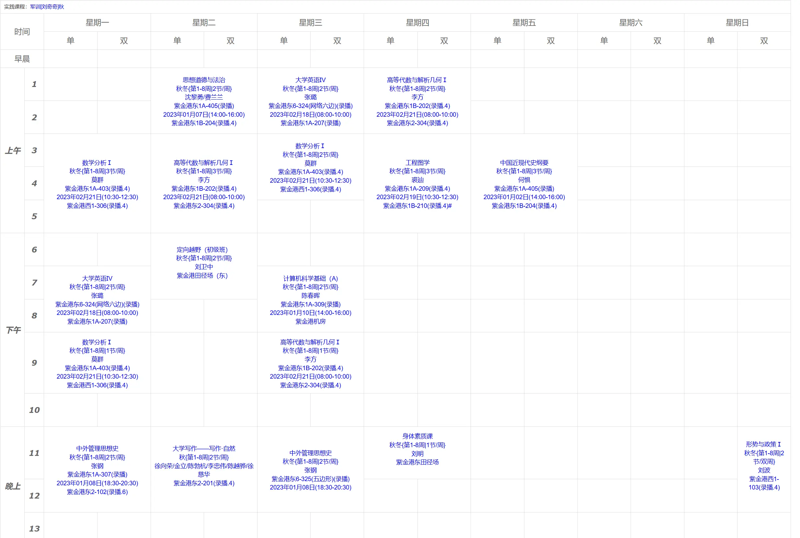

# 基本概念

<!-- 原版本中的本科生涯部分这里不再复现，主观上我并不想过于强调这个社会时钟。 -->

## 学期安排

1. 长学期:
浙江大学每年将安排两个长学期，分别称为“秋冬学期”和“春夏学期”，分别对应高中的“上册”和“下册”。每一长学期共有16个教学周和1个期末考试周（10~14天）。
2. 短学期:
每个长学期各自分为2个短学期，分别称为“秋学期”“冬学期”“春学期”“夏学期”，新生在秋学期入学。秋学期第八周和冬学期第一周的周末安排秋冬长学期期中考试；春学期第八周和夏学期第一周的周末安排春夏学期期中考试。冬学期、夏学期结束后安排期末考试周。
3. 小学期:
仅部分专业存在小学期，一般安排在春夏学期期末考试周之后，即在暑假期间开展教学，时长为1~4周不等，通常为实验类或实践类课程。

## 课程表

1. 课程时间安排:
原则上周一~周日均可安排课程，但在实际排课中，周五下午、晚上和周末一般不安排课程，仅安排在周一~周五上午。大一学年`形势与政策I`课程将安排在周日晚，此外习题课、身体素质课和部分辅修专业课程也可能安排在周末。
2. 课表与课程时间:
每位学生选课完毕后，都会得到独属于自己的一份课程表。学生需要按照课表，在对应时间，前往对应地点上课。浙江大学课程时间安排如下表所示（以我大二夏学期课表和另一位同学大一课表为例为例）。课程时间见[校历](../basics/school_calendar.md)

注：冲突选课在特殊情况下是被允许的，在必要的情况下，如果课程允许冲突，可以在补选阶段提交补选申请，通过后自动选进课表，形成冲突选课（如上图的周三1，2节，详见下文）。

周五下午一般情况用于院系学园等举办的活动等。周末一般仅安排辅修课程等。

以上课表中每一名称相同的课程称为一门课（实质为课程代码相同）。对课程可进行以下分类：

1. 按照课程持续时间长短
    1. 短学期课程：仅8周，如复变函数与积分变换；
    2. 长学期课程：16周，如大学英语IV和思想道德与法治；
    3. 部分课程如“生命科学导论实验”,“形势与政策I”仅少数周次须上课。
2. 按照课程周次安排
    1. 每周均上课；
    2. 分单周、双周上课；
    3. 每周均上课但单双周课时不同：极少数课程，如电路与模拟电子技术（单周6课时，双周5课时）。
3. 按课程性质分类
    1. 理论课程：所有课时均为理论课课时，如数学分析I；
    2. 实验课程：所有课时均为实验课课时，如大学物理实验；
    3. 理论与实验结合：既有理论课时又有实验课时，如电子电路基础；
    4. 实践课程：一般安排在暑学期，如认识实习。
4. 其他分类
    1. 荣誉课程：通常为课程名字带（H）的课程，为竺可桢学院主导开设，往往可以替换同名的非荣誉课程。
    2. 竺院课程：除了荣誉课程之外，还有部分竺院课程为竺院学生或荣誉项目学生等修读。
    3. 思政课、体育课、荣誉课程原则上不允许免听（因而也就不允许冲突）。

### 课时

每45分钟称为1节课，也称为1个课时。每节课每周一般上1~2次课，每次课课时安排可能存在以下情形：

1. 每次1节:
一般为一些特殊课程，如身体素质课。
2. 每次2节:
常见的课程安排，可能安排在1~2节、3~4节、6~7节、7~8节、9~10节或11~12节，如中外管理思想史、体育课。
3. 每次3节:
常见的课程安排，可能安排在3~5节、6~8节和11~13节，如数学分析I、毛概。
4. 每次3节以上:
一般为须长时间开展的实验课，时间不定，可能持续一上午、一下午甚至一整天，如无线网络应用。

## 四课融通

除教学课堂以外，在教室之外，浙江大学还同时设置了第二课堂、第三课堂、第四课堂，打造四课融通的培养体系。

**第一课堂:**
第一课堂是真实的课程，也是最重要的课堂。所有在前文列表中列出的课程均属于第一课堂，所有培养方案中有明确名称的课程都为第一课堂，所有教务管理系统中可以选择的课程均为第一课堂，包括理论课，也包括实验课和实践教学。

**第二课堂:**
第二课堂是学生在校内课外进行的培养锻炼，设置4学分要求。主要包括创新创业竞赛、素质训练、学科竞赛、学术研究、社团工作、学生工作、文体活动等众多项目。学生以上方面完成工作和锻炼，取得一定的成绩，即可获得相应的学分记点。

主要获得方法有：
学科竞赛：各类各级学科竞赛（如全国大学生数学竞赛、数学建模竞赛）;
创新创业训练及素质训练：SQTP、SRTP、NESP等;
创新实验：各类创新实验竞赛、自主创新实验项目;
学术研究：学术论文、专利、产品软件等;
学生社团组织工作经历：参与各种学生社团或组织满一年;
文体活动：包括但不限于运动会、各种“三好杯”比赛;

同时，二课分有“美育”要求，要求必须有1分美育二课分，获得方法包括但不限于参加部分社团精品课、观看演出、参加部分“三好杯”项目。

**第三课堂:**
第三课堂是学生在境内校外进行的实践锻炼，设置2学分要求。主要包括创业实践、就业实习、社会实践和志愿服务等项目。学生在以上方面完成工作和锻炼，取得一定成绩，即可获得相应的学分记点。

主要获得方法包括：
社会实践：参与社会实践累计一周以上可获1.5记点;
星级志愿者：一星级荣誉奖的获1.5记点、二星级的获2记点、三星级的获2.5记点、四星级的获3记点、五星级的获3.5记点;
就业实践：就业实习实践满一个月以上;
创业实践：参与相关创业实践.

三课分还有劳育要求，即每个学生必须有一次社会实践。

**第四课堂:**
第四课堂是学生在境外开展的交流锻炼，设置2学分要求（可用第三课堂学分替换）。主要包括暑期课程、短期交流、境外实习、交换生等项目。学生在以上方面完成工作和锻炼，取得一定成绩，即可获得相应的学分记点。

第四课堂获得方法：
参与联合培养项目;
参与境外交流并获得学分;
在境外参与实习实践、毕业设计等两个月以上;
经学校认定的国际化课程;
其余学校认定的本科生交流项目.

此外，可用三课分转化为四课分，要求为：三课堂大于等于4分，且做过一次社会实践，修读过学校的国际化课程。

更多信息可参考[素拓网](http://sztz.zju.edu.cn/dekt/)
## 学分

学分是学生已合格课程的学习总量的度量，与是否能够毕业息息相关，同时也与课程课时和缴纳的学费密切相关。

1. **学分的获取:**
修读完课程并通过课程考核，认定为“合格”即可获得该门课程对应的学分。课程不合格俗称“挂科”，若有设置补考，补考合格后可获得学分，不合格或无补考机会则无法获得学分，可以选择不再修读或重新修读。
2. **学分与毕业:**
只有满足以下条件，学生方可毕业：
（1）未被退学且未超过修读年限；
（2）培养方案中每一类课程学分均≥该类课程毕业要求学分；
（3）培养方案中每一类课程均满足特定的修读要求。
3. **学分与课时:**
1学分 = 16理论课课时 = 32实验课课时。例如：1门16周长学期理论课，每周2次，每次2课时，则该课程为2×2×16 = 64课时，即4学分。在实际执行中，部分课程虽设置为理论实践结合的课程，但实际教学中理论课程偏多，实验课程偏少，就可能出现课时“加量不加价”的情况。
4. **学分与学费:**
每获得1学分，学生需要支付120元学分费。总学费 = 专业注册学费 + 学分学费。其中专业注册学费数额是固定的，在招生章程中有说明。招生章程中所列学费已预留40学分学分费，即：总学费 = 专业注册学费 + 120 × 40。

## 绩点

绩点是学生学业成绩的度量，如果说学分是“量”，绩点则是“质”。浙江大学采用五分制绩点，出国留学在2021级及以前一般采用四分制绩点，2022级及以后采用4.3分制。

### 绩点换算规则

|百分制 |五分制|      四分制      |4.3分制|
|-|-|-|-|
|95-100      |5.0|      4.0      |4.3     |
|92-94      |4.8|      4.0      |4.2      |
|89-91      |4.5|      4.0      |4.1      |
|86-88      |4.2|      4.0      |4.0      |
|83-85      |3.9|      3.9      |3.9      |
|80-82      |3.6|      3.6      |3.6      |
|77-79      |3.3|      3.3      |3.3      |
| 74-76   |   3.0    |3.0   |   3.0|
|71-73    |  2.7     | 2.7  |    2.7|
|68-70    |  2.4     | 2.4  |    2.4|
|65-67    |  2.1     |2.1   |   2.1|
|62-64    |  1.8     |1.8   |   1.8|
|60-61    |  1.5     | 1.5  |    1.5|
|0-59     | 0        |0     | 0|

### 特殊课程绩点

#### 五级制

少数课程（如通识核心课程）不进行百分制评分，仅给予A、B、C、D、F五个等级的评级。A对应4.5绩点，B对应3.5绩点，C对应2.5绩点，D对应1.5绩点，F对应不合格（0绩点），以上绩点计入学生平均绩点中。

#### 二级制

部分认定型课程如英语水平测试、体测，仅有“通过”与“不通过”之分。通过则给予3.0绩点，不通过则给予0绩点，但该绩点不会计入学生平均绩点。

### 特殊概念

#### 成绩等级

学生课程成绩按照百分制，可分为优秀、良好、合格、不合格四个等级。其中“优秀”对应90-100分，“良好”对应80-89分，“合格”对应60-79分，“不合格”对应0-59分。

#### 正态分布

学生修读的部分课程（如思政类、通识选修类）课程成绩须满足“正态分布”规律，即：各门课程总评成绩优秀或90分以上比例一般不宜超过30%。实际情况视具体课程而定。

#### 满绩与卡绩

学生课程绩点为5.0（95-100分）称为“满绩”。百分制分数为对应绩点的最高分（如91、88），差1分绩点即可向上提高一个层次，则称为“卡绩”。

### 平均绩点（GPA）

学生的平均绩点（Grade Point Average），简称均绩（GPA），是衡量学生整体学业成绩的核心指标，直接与奖学金、推免资格等挂钩。GPA为学生修读的所有课程（除不计入绩点的特殊课程外）绩点的加权平均

平均绩点计算公式为：课程平均学分绩点= $\frac{\sum (\mbox{绩点}\times \mbox{学分})}{\sum \mbox{课程学分}}$

注：绩点包含五分制、四分制、四点三分制、百分制，可带入不同绩点计算。
