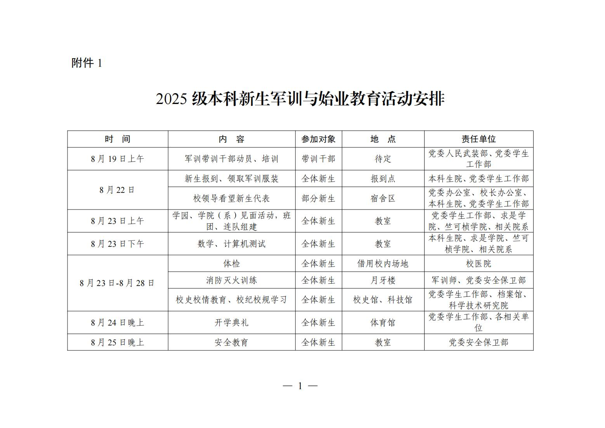
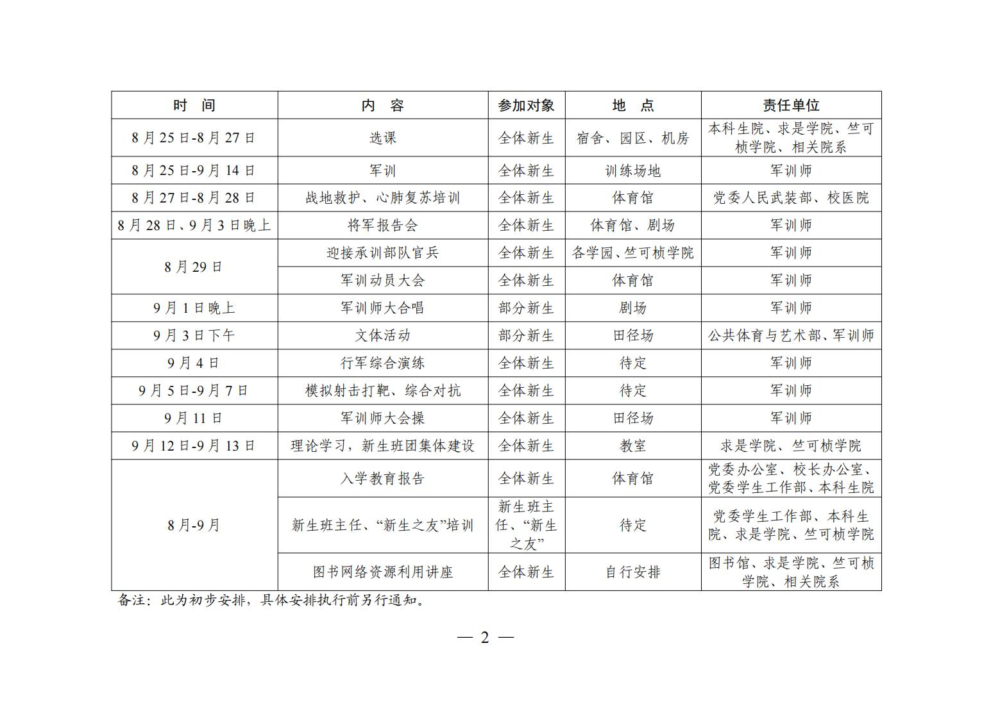

# 始业教育

## 班级组建

### 大类班级与专业班级

大类班级即新生入学时所处的班级，隶属学园管理。班级内所有学生均为同一大类学生，且根据班级按就近原则分配寝室。通常情况下，每一大类班级学生人数为25~30人。大一学年，所有学生在大类班级中，由学园进行培养和管理。
大一学年结束后，所有学生根据专业确认结果，分流至各学院进行管理和培养，进入“专业班级”。原大类班级自然解散，学生离园。

### 班级人员配备

- 专职辅导员1名：约每8个大类班级配备1位专职辅导员。辅导员主要负责学生思想政治教育、党团班级建设、学业指导、日常事务管理、心理健康教育与咨询、网络思政教育、危机事件应对、职业规划与就业指导等方面。专职辅导员承担了“高中班主任”的角色，新生绝大多数问题可以寻求专职/兼职辅导员的帮助。
- 班主任1名：每一班级配备1位班主任。班主任为浙江大学教师，主要负责对应行政班班级相关工作，但与高中不同，大学班主任与学生接触较少；
- 兼职辅导员1名：每一班级配备1位兼职辅导员。兼职辅导员为浙江大学在校研究生，辅助专职辅导员开展相关工作，与学生接触较多；
- 学长组1组：每一班级配备1组学长组，通常为4~6人。学长组为浙江大学大二及以上的本科生，主要负责引导班级同学完成班团组建、始业教育和新生选课，带领大一新生熟悉大学生活；
  学长组有统一的服装，各大学园请认准相应的学长组：

- 新生之友：每一寝室配备1位新生之友。新生之友为浙江大学教师，负责与寝室对接，为寝室学生的学习、生活和职业规划指明方向。
> 2025年起，新生之友的配置与职责预计进行调整，具体方案待定。

### 班委、团支委竞选

新生报到结束后，兼职辅导员、学长组将很快带领大类班级同学开展破冰活动，并进行班级班委和团支部团支委的竞选，这部分各个学园有所不同，一般主要包括：

- 团支书1名：负责班级党团建设方面工作（如团员推优、团内评奖评优、主题团日等）；班长与团支书是班委的骨干力量；
- 班长1名：兼任副团支书，开展班级建设，建立班级文化，做好日常事务性工作，与班主任、辅导员、兼职辅导员等密切联系；
- 学习委员1名（班委）：负责组织开展班级学风建设、生涯规划等工作，引导班级形成良好学习氛围，做好相关保障；
- 生活委员1名（班委）：负责全班各寝室卫生工作，负责学生资助和班级内财务管理工作；
- 文体委员1名（班委）：负责班级文化氛围建设，组织安排班级内文体活动，组织参与学园、学校的各项活动，引导文体融入学生日常；
- 心理委员男女各1名（班委）：做好对班级同学心理状态观察，及时向辅导员、班主任反映学生心理动态，对有需要的同学进行心理疏导；
- 组织委员1名（团支委）：协助团支书开展班级活动组织、档案管理等工作；
- 青志委员1名（团支委）：对接学园青志、素拓相关组织，负责协助同学解决志愿服务相关（志愿者信息录入，问题解答，小时数补录，志愿活动立项）和社会实践相关（问题解答，社会实践活动立项）问题
- 宣传委员1名（团支委）：协助团支书做好团员思想引领工作，做好对外宣传和团支部文化建设工作

> 团支书、副团支书和团支委是团干部，在团内评奖评优中可以参评优秀团干；其他职务不属于团支委，不得参评优秀团干。
